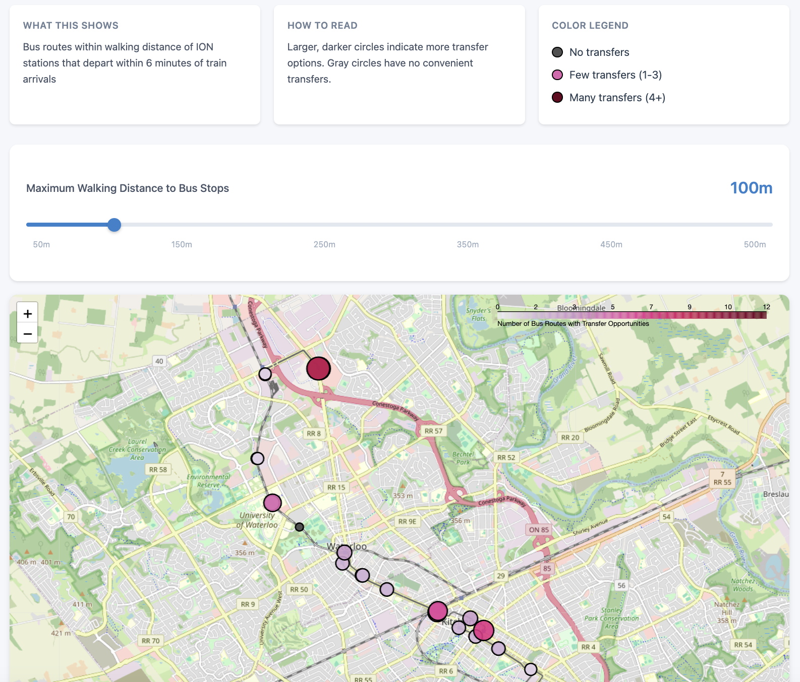

# ION-Bus Connect

An interactive visualization tool that analyzes transfer opportunities between ION light rail and bus routes in Waterloo Region during peak hours.

## Overview

This tool helps transit users identify which ION stations offer the best connections to bus routes. It analyzes GTFS (General Transit Feed Specification) data to find bus stops within walking distance of ION stations where buses depart shortly after train arrivals.

### Key Features
- 🚊 Analyzes all 19 ION light rail stations
- 🚌 Identifies convenient bus transfer opportunities 
- 🗺️ Interactive map with adjustable walking distances (50-500m)
- ⏰ Focuses on morning peak hours (7:00-9:00 AM)
- 📊 Color-coded visualization showing transfer quality

## Demo



View the interactive map by opening `output/index.html` after running the analysis.

## Installation

### Prerequisites
- Python 3.7+
- pip package manager

### Setup

1. Clone the repository:
```bash
git clone https://github.com/yourusername/ion-bus-connect.git
cd ion-bus-connect
```

2. Install dependencies:
```bash
pip install -r requirements.txt
```

## Usage

### Basic Usage

Run the analysis with default settings:
```bash
python ion_bus_connect.py
```

Or with custom parameters:
```bash
python ion_bus_connect.py --help  # See all options
python ion_bus_connect.py --buffer 200 --time 17:00 19:00
```

This will:
- Download the latest GTFS data from Region of Waterloo
- Analyze transfer opportunities with 100m walking distance
- Generate an interactive map at `output/ion_transfer_map.html`

### Interactive Multi-Distance Analysis

To generate maps for multiple walking distances:
```bash
python build_transfer_index_interactive.py
```

Then open `output/index.html` for an interactive slider interface.

### Customization

Edit parameters at the top of `build_transfer_index.py`:

```python
SERVICE_DATE = "2025-06-10"    # Weekday to analyze
PEAK_START = "07:00:00"        # Start of time window
PEAK_END = "09:00:00"          # End of time window
BUFFER_METRES = 100            # Walking distance to bus stops
MAX_TRANSFER_M = 6             # Maximum wait time for transfer
```

## How It Works

1. **Data Collection**: Downloads GTFS data from Region of Waterloo containing both ION and bus schedules
2. **Stop Identification**: Identifies all ION stations and nearby bus stops within the specified walking distance
3. **Transfer Analysis**: For each ION arrival during peak hours, finds bus departures within 0-6 minutes
4. **Visualization**: Creates an interactive map where:
   - Circle size represents the number of transfer options
   - Colors range from gray (no transfers) to dark red (many transfers)

## Output Files

After running the analysis, you'll find:
- `output/ion_transfer_index.csv` - Raw data with transfer counts per station
- `output/ion_transfer_index.geojson` - Geographic data for GIS applications
- `output/ion_transfer_map.html` - Interactive visualization map

## Data Source

Transit data is sourced from:
- [Region of Waterloo Open Data](https://www.regionofwaterloo.ca/opendatadownloads/GRT_GTFS.zip)
- Updated regularly by Grand River Transit (GRT)

## Understanding the Results

- **Gray circles**: ION stations with no convenient bus transfers
- **Purple to red circles**: Stations with transfer opportunities (darker = more options)
- **Circle size**: Larger circles indicate more bus routes available

Example: University of Waterloo Station shows 5 transfer options, meaning 5 different bus routes depart from nearby stops within 6 minutes of ION arrivals.

## License

This project is licensed under the MIT License - see the [LICENSE](LICENSE) file for details.

## Acknowledgments

- Grand River Transit for providing open GTFS data
- Region of Waterloo for supporting open data initiatives